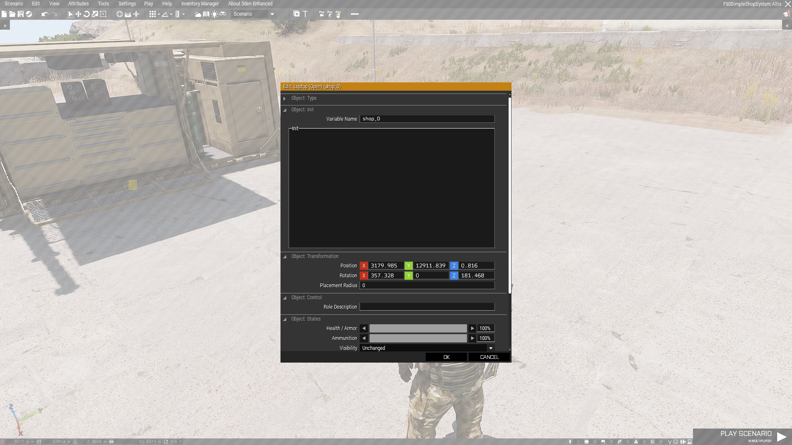
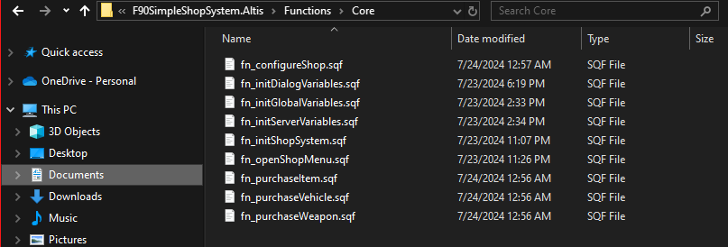
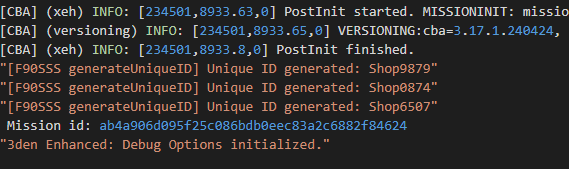
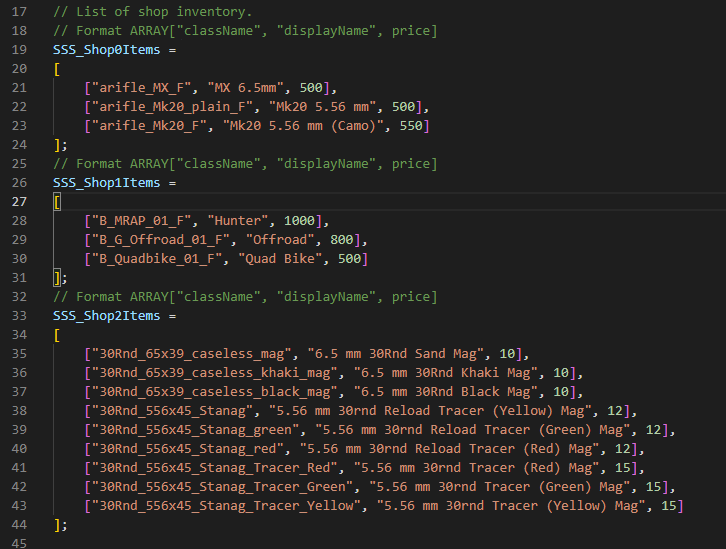
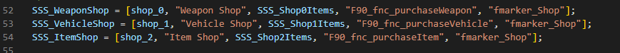
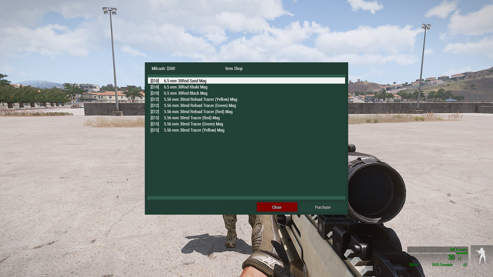
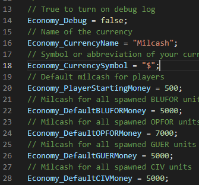

# Getting Started (F90 Simple Shop System)
This page will help mission designers to quickly setup desired custom shop

## Placing Shops 
Anything in the game can be turned into a shop. So you're free to pick anything as your shop.
After you've placed your shop, name each of it to something that's easy to remember. I recommend something like Shop_0, Shop_1, etc.

## Configure The Shop
We haven't added anything to our shop yet. We need to configure the system first. Open up the scripts folder and look for "fn_configureShop.sqf" inside `Functions/Core/fn_configureShop.sqf`.

By now, I expected you to open the file with any text editor. Visual studio is my favourite.
There are a lot of things going on, but I promise I will guide you through each. 

### SSS_Debug
Setting SSS_Debug to true will enable debug logging. This is helpful for mission designers incase of any errors appear with the code. Turning this on won't do much, it will just give you the idea on the flow of the code, like which function runs first before which. It also help to understand if certain function has been executed.

### Adding Inventories 
I've already laid out a few example inventories (SSS_Shop1Items, SSS_Shop2Items). You can add your own inventory list, as long as you follow the [shop inventory format](ShopInventoryFormat.md). 

If you has the IQ for this, maybe automating (by AI or by script) the adding process might save you some time. Visual Studio's AI, [Bito](https://marketplace.visualstudio.com/items?itemName=Bito.Bito) works best too. Plus it's free.

### Adding Shops
The shop itself won't be identified by the system if you didn't define it. But defining it is not a walk in the park. But I'll walk you through it. 
Each shop has a **data** and has a format need to be respected. Take a look at [shop data](ShopData.md) for a guide on setting your own shop.

### All Shops
Lastly, you will need to store the data of all shops inside SSS_AllShops. From here, the system will automatically create your shop, and add it's inventories along with a menu for you to purchase those inventories.

## Configure the Economy System
Heads to `Functions/Economy/fn_configureEconomy.sqf` to configure the economy system. The economy system doesn't need a lot of configuration. Leaving it as it is won't be a problem too.
The `Economy_Debug` is not important. You can leave it to false. The `Economy_CurrencyName` is the name of your currency like "CASH" meanwhile `Economy_CurrencySymbol` is the symbol of your currency. Usually people admire "$".

### Functions
There are some useful functions come with the Economy System such as:

1. F90_fnc_setMoney
2. F90_fnc_getMoney
3. F90_fnc_addMoney
4. F90_fnc_deductMoney

All of this functions related the economy system, and for now it handles most essential process related to economy. If you prefer to use or already had your's, you can ignore these functions. But a lot of modification to the Shop System might be needed, as the system is fully dependent on the Economy System.
