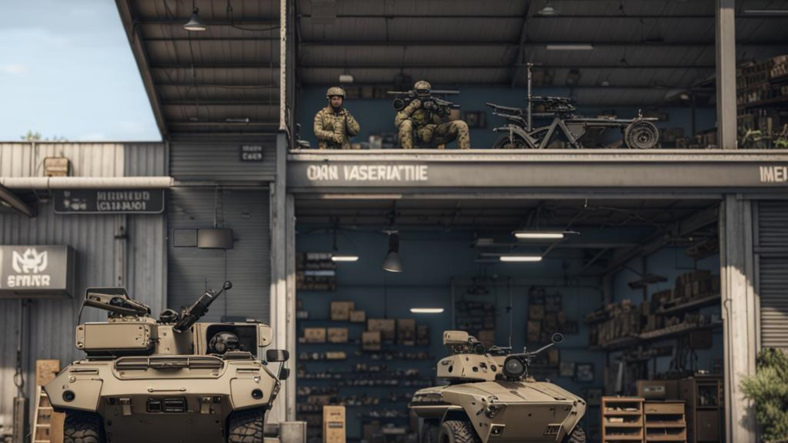

# F90 Simple Shop System

## Description
F90 Simple Shop System is a script that enables ARMA 3 mission maker to easily implement a shop system in their custom mission. This system is a part of my current project, Project RedS******. Not yet released

## Features 
* Can be used to create any kinds of shops(Vehicle shop, weapon shop, recruit units, and etc).
* Any objects can be assigned as a shop. 
* Fast and fully optimized. 
* Fully customizeable according to your preference.
* Easy to maintain.

## Installation
* Download the latest release from the [releases](https://github.com/NikolaiF90/F90SimpleShop/releases) page.
* Extract F90SimpleShopSystem from the zip file to your mission folder.

## Usage
* Copy all the files inside F90SimpleShopSystem into your mission folder.
* Open 3DEN Mission Editor.
* Add your shop objects across the map. Shop objects can be anything from units to objects. 
* Name your shop object to something that can be easily remembered like VehicleShop_0, VehicleShop_1 and so on.
* Read [Getting Started](Guide/GettingStarted.md).

## Contributing
* Fork the repository.
* Create a branch for your changes.
* Create a pull request. 

## License 

With this license you are free to adapt (i.e. modify, rework or update) and share (i.e. copy, distribute or transmit) the material under the following conditions:   
* Attribution - You must attribute the material in the manner specified by the author or licensor (but not in any way that suggests that they endorse you or your use of the material).
* Noncommercial - You may not use this material for any commercial purposes.
* Arma Only - You may not convert or adapt this material to be used in other games than Arma.
* Share Alike - If you adapt, or build upon this material, you may distribute the resulting material only under the same license.

## Credits
* [NikolaiF90 (PrinceF90)](https://github.com/NikolaiF90)
